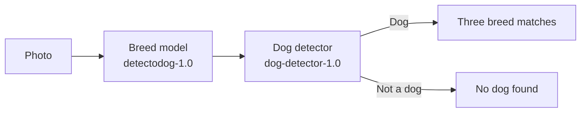

# 🐕 DetectoDog

DetectoDog identifies the likely breed of a dog from a photograph. The model recognises 120 breeds and returns its three closest matches.

## 📱 App

The Expo app runs on Android and the web. It can take a photo or use one from the photo library, submit it for classification, save results locally and share a result.

The web app is an installable PWA. Android preview builds are produced as APK files through Expo EAS.

## 🧠 Models and API

DetectoDog uses two separate ONNX models:

- `detectodog-1.0` recognises 120 dog breeds.
- `dog-detector-1.0` decides whether the image is likely to contain a dog.



The breed model is an EfficientNet-B0 model trained on the [Stanford Dogs data set](http://vision.stanford.edu/aditya86/ImageNetDogs/):

- 20,580 images
- 120 breeds
- 84.36% best validation accuracy

The detector is a small classifier trained from the breed model's output. It prevents weak forced matches for images such as landscapes, vehicles and furniture. The original breed model remains unchanged.

Both models are packaged in one API container and run inside the same Lambda request. There is one public API and no second service to operate.

The notebooks and training scripts cover data preparation, augmentation, transfer learning, evaluation and ONNX export.

Photos are processed in memory and are not stored by the API.

Breed profiles are supplied by the free [Stratonauts Dog API](https://dogapi.dog/). The API service fetches current details by breed and keeps a versioned local fallback, so the app still works if the provider is temporarily unavailable.

[](https://nbviewer.org/github/mm-camelcase/detectodog/blob/main/detectodog_final_structured.ipynb)

## ☁️ AWS

Terraform provisions one production environment in `eu-west-1`:

- API Gateway and Lambda for inference
- ECR for the API container and both ONNX models
- S3 and CloudFront for the web app
- CloudWatch logs and an AWS budget alert

The Lambda scales to zero when unused. Expected portfolio usage is approximately €0–€5 per month.

## 🛠 Development

Use Node.js 20 or newer.

```bash
cd app
cp .env.example .env
npm install
npm start
```

Set `EXPO_PUBLIC_API_URL` in `app/.env` before running the app.

Run the API with Python 3.12:

```bash
python -m venv .venv
source .venv/bin/activate
pip install -r api/requirements-dev.txt
PYTHONPATH=api uvicorn app.main:app --reload
```

## ✅ Checks

GitHub Actions checks the app, API and Terraform on every push and pull request. It also builds and launches the Android release on an emulator to catch startup crashes.

```bash
cd app
npm run verify
```

## 🔮 Current limits

- Breed profiles depend on third-party data and may not cover every model label.
- Results are visual estimates, not genetic tests.
- Mixed breeds and breeds outside the trained 120 may return a low-confidence result.
- Dog detection is a visual estimate and can still make mistakes.
